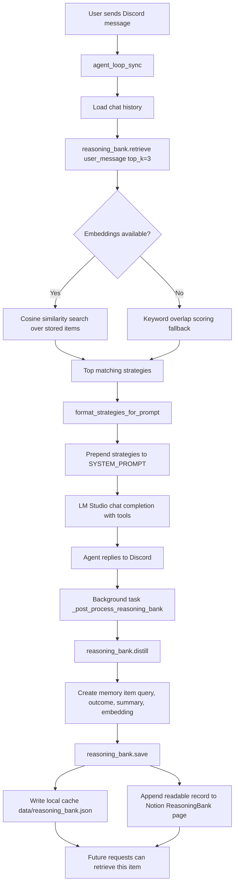

# Saiyan Research Agent: Son Goku

Your private, local-first personal AI agent that lives in Discord, with Son Goku as the assistant persona.

It runs on your own machine with LM Studio, searches through your self-hosted SearxNG stack, and can work with Notion + Google Drive as tools. No SaaS lock-in, no hidden cloud inference bill, and no telemetry from this repo.

The project name is Saiyan Research Agent. The default in-chat persona is Son Goku, so the assistant feels personal without changing the underlying local-first architecture.

## Why This Project

Most assistants are trapped in someone else's cloud. This one is built to be yours:

- Local LLM inference through LM Studio
- Dockerized runtime for reproducible setup
- Tool-using agent loop for real tasks, not just chat
- Easy to extend with your own tools and workflows

## What It Can Do

- Search the web with SearxNG (plus fallback behavior in code)
- Read URLs and summarize content quickly
- Scrape X/Twitter post text for cleaner downstream writing
- Write content: LinkedIn posts, Substack notes/posts, short bullet notes
- Read and write Notion content (scoped to a parent page)
- Create native Notion task lists and calendar entries
- List/search Google Drive files
- Send messages to other Discord channels by channel ID
- Keep conversation memory and save distilled learnings

## Architecture

| Component | Container | Purpose |
|---|---|---|
| `agent` | `son-goku-agent` | Discord bot, tool orchestration, LM Studio client |
| `searxng` | `son-goku-searxng` | Self-hosted metasearch engine on port `8080` |

LM Studio runs on the host machine. The container reaches it at `host.docker.internal:1234`.

## How The Reasoning Bank Works

The reasoning bank is a lightweight memory layer that stores reusable strategies from past interactions and feeds the best ones back into future prompts.

It works in three phases:

1. Retrieval before generation.
The agent calls `reasoning_bank.retrieve(user_message, top_k=3)` to find the most relevant past items. Those items are formatted into a short strategy block and prepended to the system prompt before the main LM Studio chat completion runs.

2. Distillation after the reply.
Once the agent has answered, it starts a background task that asks the local model to summarize the interaction into one concise lesson or strategy. The stored item includes the original query, a success or failure outcome label, a short summary, and an embedding when the embedding endpoint is available.

3. Persistence and reuse.
The new item is appended to a local JSON cache at `data/reasoning_bank.json`. The same item is also written to a Notion page named `ReasoningBank` when Notion is configured, which gives you a human-readable long-term record in addition to the local machine cache.

If embeddings are unavailable, retrieval falls back to a simpler keyword-overlap score. That means the feature still works, but relevance quality is lower than the embedding-based path.



### Code Path

- Retrieval is triggered in `agent_loop_sync` before the main model call.
- Prompt injection happens only when at least one relevant strategy is found.
- Distillation and saving happen asynchronously after the user already has a response, so the bank does not block the main reply path.
- Local cache is the fast read path; Notion is the secondary durable record.

## Quick Start

1. Create your env file.
2. Start LM Studio and load a model.
3. Bring up Docker services.

```bash
cp .env.example .env
docker compose up --build -d
docker compose ps
```

When startup succeeds, your bot appears online in Discord.

## Environment Variables

| Variable | Default | Description |
|---|---|---|
| `DISCORD_TOKEN` | - | Bot token from Discord Developer Portal |
| `LMSTUDIO_BASE_URL` | `http://host.docker.internal:1234/v1` | LM Studio OpenAI-compatible endpoint |
| `LMSTUDIO_API_KEY` | `lm-studio` | LM Studio accepts any non-empty value |
| `MODEL` | `local-model` | Model id as exposed by LM Studio |
| `AGENT_NAME` | `Son Goku` | Agent persona name shown in chat |
| `SEARXNG_URL` | `http://searxng:8080` | SearxNG URL from inside Docker network |
| `NOTION_API_KEY` | - | Notion integration secret |
| `NOTION_PARENT_PAGE_ID` | - | Root page id the agent is allowed to write under |
| `GOOGLE_CREDENTIALS_FILE` | `credentials.json` | OAuth client secret file path |
| `GOOGLE_TOKEN_FILE` | `token.pickle` | Cached Google OAuth token path |
| `EMBEDDING_MODEL` | `nomic-embed-text-v1.5` | Optional embedding model for reasoning bank |

## Discord Setup (Add The Agent)

1. Open Discord Developer Portal and create a new application.
2. Add a bot user under the Bot tab.
3. Enable intents needed by this project (at least Message Content intent).
4. Copy the bot token and set `DISCORD_TOKEN` in `.env`.
5. Under OAuth2 > URL Generator:
- Scopes: `bot`
- Bot permissions: `Send Messages`, `Read Message History`, `View Channels`
6. Use the generated invite URL to add the bot to your server.
7. Restart service:

```bash
docker compose restart agent
```

## Google Drive Setup (Add Drive Tool)

This project uses OAuth with a local browser flow and stores a token in `token.pickle`.

1. In Google Cloud Console:
- Create/select a project
- Enable Google Drive API
- Configure OAuth consent screen
- Create OAuth Client ID (Desktop App)
2. Download the OAuth client JSON and place it in project root as `credentials.json`.
3. Refresh local token:

```bash
python refresh_credentials.py --rebuild
```

4. Confirm `token.pickle` was created and agent rebuilt.
5. Ask the bot to list or search files to verify integration.

Notes:

- If your credentials file has another name/path, set `GOOGLE_CREDENTIALS_FILE`.
- Never commit `credentials.json` or `token.pickle`.

## Public Release Readiness Checklist

Before publishing this repo:

1. Remove and rotate any exposed secrets (Discord/Notion/API keys) from local `.env`.
2. Keep only template values in `.env.example`.
3. Confirm credential artifacts are ignored: `.env`, `credentials.json`, `token.pickle`.
4. Verify setup from scratch in a clean clone.
5. Confirm repository metadata files are present and accurate before launch:
- `LICENSE`
- `CONTRIBUTING.md`
- `SECURITY.md`
6. Add CI checks for tests/lint so contributors can safely extend the agent.

## Useful Commands

```bash
# Check containers
docker compose ps

# Verify SearxNG
curl "http://localhost:8080/search?q=test&format=json" | python -m json.tool | head -20

# Verify LM Studio from container
docker exec son-goku-agent curl -s http://host.docker.internal:1234/v1/models | python -m json.tool

# Fast syntax check
docker exec son-goku-agent python -m py_compile agent.py && echo "syntax OK"

# Restart agent after code edits
docker compose restart agent

# Rebuild on dependency changes
docker compose up -d --build agent

# Stop all services
docker compose down
```

## Project Layout

```text
agent.py
main.py
docker-compose.yml
Dockerfile
refresh_credentials.py
requirements.txt
pyproject.toml
tools/
tests/
docs/
```

## Suggested Future Updates

1. Add provider abstraction so users can swap LM Studio with Ollama/OpenRouter-compatible endpoints.
2. Add Slack and Telegram adapters alongside Discord.
3. Ship role-based tool permissions (reader/writer/admin modes).
4. Add a web dashboard for memory, traces, and tool-call observability.
5. Add plugin registry so users can enable/disable tools from config.
6. Add offline eval suite with golden prompts and regression scoring.
7. Add GitHub Actions CI for tests + lint + Docker build verification.

## License

This project is licensed under Apache-2.0. See `LICENSE` for the full text.

## Security

See `SECURITY.md` for reporting guidance, supported release expectations, and local deployment security notes.
