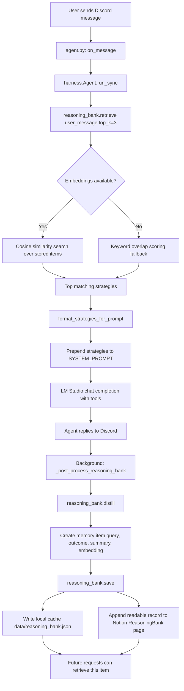

# Saiyan Research Agent: Son Goku

Your private, local-first personal AI agent that lives in Discord, with Son Goku as the assistant persona.

It runs on your own machine with LM Studio, searches through your self-hosted SearxNG stack, and can work with Notion + Google Drive as tools. No SaaS lock-in, no hidden cloud inference bill, and no telemetry from this repo.

The project name is Saiyan Research Agent. The default in-chat persona is Son Goku, so the assistant feels personal without changing the underlying local-first architecture.

## Why This Project

Most assistants are trapped in someone else's cloud. This one is built to be yours:

- Local LLM inference through LM Studio (or Ollama / OpenRouter / OpenAI)
- Dockerized runtime for reproducible setup
- Tool-using agent loop for real tasks, not just chat
- Easy to extend with your own tools and workflows
- Standalone CLI for running the agent without Discord
- Modular harness architecture — Discord is one adapter, not the core

## Architecture

### New Harness Architecture

The project has been refactored into a clean, modular structure:

```
├── harness/              # Standalone agent package (no Discord dependency)
│   ├── __init__.py       # Public API: from harness import Agent
│   ├── harness.py        # Core Agent class + AgentResult dataclass
│   ├── models.py         # Provider abstraction (LM Studio / Ollama / OpenRouter / OpenAI)
│   ├── tool_registry.py  # Unified tool registry with schema + call handlers
│   └── system_prompt.py  # System prompt construction with strategy injection
├── cli.py                # Standalone CLI (python cli.py --prompt "...")
├── agent.py              # Discord bot — delegates to harness/Agent
├── main.py               # Entry point (demo, discord, standalone)
├── config.py             # Pydantic config: ModelConfig, AgentConfig, DiscordConfig, ...
├── tools/                # Tool implementations
│   ├── search.py         # SearxNG / DuckDuckGo search
│   ├── url_reader.py     # Web page fetching
│   ├── x_scraper.py      # X/Twitter post scraping
│   ├── content_writer.py # LinkedIn / Substack / notes writing
│   ├── notion.py         # Notion read/write/inspector
│   ├── drive.py          # Google Drive integration
│   ├── discord_tool.py   # Discord message sending
│   └── memory.py         # Conversation history + compression
├── core/
│   └── reasoning_bank.py # Strategy retrieval, distillation, persistence
├── tests/                # Unit tests
└── data/                 # Local cache (reasoning_bank.json)
```

**Key design principles:**

1. **No dependency from harness → Discord.** The harness works standalone.
2. **Provider abstraction.** Any OpenAI-compatible API works — swap endpoints by changing config.
3. **Unified tool registry.** All tools are registered once with schemas and handlers.
4. **Modular config.** Pydantic models for all configuration sections with env var overrides.

### Components

| Component | Container | Purpose |
|---|---|---|
| `agent` | `son-goku-agent` | Discord bot (harness + Discord adapter) |
| `searxng` | `son-goku-searxng` | Self-hosted metasearch engine on port `8080` |

LM Studio runs on the host machine. The container reaches it at `host.docker.internal:1234`.

### Tool Registry

All tools are declared in `harness/tool_registry.py` with:

- **Tool schemas** — OpenAI-compatible function definitions (name, description, parameters)
- **Handlers** — Lambdas that map tool names to the actual tool implementation
- **Error handling** — All tool errors are caught, logged, and reported back to the agent

Additional tools can be added by:
1. Adding a new entry to `TOOL_SCHEMAS`
2. Importing the handler in `_load_tools()`
3. Adding a lambda to the `handlers` dict

## What It Can Do

- Search the web with SearxNG (plus DuckDuckGo fallback)
- Read URLs and summarize content quickly
- Scrape X/Twitter post text for cleaner downstream writing
- Write content: LinkedIn posts, Substack notes/posts, short bullet notes
- Read and write Notion content (scoped to a parent page)
- Create native Notion task lists and calendar entries
- List/search Google Drive files
- Send messages to other Discord channels by channel ID
- Keep conversation memory and save distilled learnings

## How To Use

### Standalone CLI (No Discord)

```bash
# Single prompt
python cli.py --prompt "What's new with Ollama?"

# JSON output
python cli.py --prompt "Summarize AI news" --json

# Interactive REPL mode
python cli.py --interactive

# With format instruction
python cli.py --prompt "Write a LinkedIn post about AI" --format linkedin

# Override provider
python cli.py --prompt "Search for X" --provider openrouter

# Custom config file
python cli.py --prompt "hello" --config-path /path/to/.env

# Show configuration
python cli.py --config

# List reasoning bank strategies
python cli.py --reasoning-bank list
```

### Via main.py (Entry Point)

```bash
# Demo — shows available tools
python main.py --demo

# Start Discord bot
python main.py --discord

# Standalone prompt via main.py
python main.py --prompt "What's new?"

# Interactive via main.py
python main.py --interactive
```

### In Code (Harness)

```python
from harness import Agent

# Create agent with defaults
agent = Agent()
print(f"Available tools: {agent.available_tools}")

# Run a single prompt
result = agent.run("What's new with Ollama?")
print(result.response)
print(f"Tool calls: {result.tool_calls_used}")

# With provider override
agent2 = Agent(model_provider="openrouter")
result2 = agent2.run("Write a short note about AI agents")

# Interactive mode
for message in ["hello", "search for X"]:
    result = agent.run(message)
    print(result.response)

# Manage history
agent.clear_history()
history = agent.get_history()
```

### Discord Bot

The Discord bot (`agent.py`) imports `Agent` from the harness and delegates all agent logic to it. Discord-specific stuff (bot setup, message parsing, command handling) stays in `agent.py`.

```bash
# Start the Discord bot
python agent.py
# or
python main.py --discord
```

Commands:
- `!clear` — Clear conversation history
- `!save` — Save chat log to Notion
- `!history` — Show last 10 messages

Mention the bot or DM it to start a conversation.

## Config Structure

All configuration is managed through `config.py` using Pydantic models:

```python
from config import get_config

cfg = get_config()
print(cfg.model.provider)        # "lmstudio"
print(cfg.agent.name)            # "Son Goku"
print(cfg.search.url)            # "http://localhost:8080"
```

### Sub-configs

| Sub-config | Purpose | Key fields |
|---|---|---|
| `ModelConfig` | LLM provider settings | `provider`, `base_url`, `api_key`, `model`, `temperature`, `max_tokens` |
| `AgentConfig` | Agent persona/behavior | `name`, `system_prompt`, `max_tool_rounds`, `compress_history_threshold` |
| `DiscordConfig` | Discord bot settings | `enabled`, `token`, `log_channel_id`, `prefix` |
| `NotionConfig` | Notion integration | `enabled`, `api_key`, `parent_page_id` |
| `GoogleDriveConfig` | Google Drive OAuth | `enabled`, `credentials_file`, `token_file` |
| `SearxNGConfig` | Search engine | `enabled`, `url`, `fallback` |
| `ReasoningBankConfig` | Memory features | `enabled`, `top_k`, `embedding_model` |

### Loading Config

- `.env` file is loaded automatically (`.env`, then `~/.saiyan/.env`)
- Environment variables override `.env` values
- Custom config path: `get_config(env_file="/path/to/.env")`

## Environment Variables

| Variable | Default | Description |
|---|---|---|
| `DISCORD_TOKEN` | - | Bot token from Discord Developer Portal |
| `LMSTUDIO_BASE_URL` | `http://host.docker.internal:1234/v1` | LM Studio OpenAI-compatible endpoint |
| `LMSTUDIO_API_KEY` | `lm-studio` | LM Studio accepts any non-empty value |
| `MODEL` | `local-model` | Model id as exposed by LM Studio (empty = auto-discover) |
| `AGENT_NAME` | `Son Goku` | Agent persona name shown in chat |
| `SEARXNG_URL` | `http://searxng:8080` | SearxNG URL from inside Docker network |
| `NOTION_API_KEY` | - | Notion integration secret |
| `NOTION_PARENT_PAGE_ID` | - | Root page id the agent is allowed to write under |
| `GOOGLE_CREDENTIALS_FILE` | `credentials.json` | OAuth client secret file path |
| `GOOGLE_TOKEN_FILE` | `token.pickle` | Cached Google OAuth token path |
| `EMBEDDING_MODEL` | `nomic-embed-text-v1.5` | Optional embedding model for reasoning bank |

### Provider-specific Env Vars

| Variable | Default | Description |
|---|---|---|
| `LMSTUDIO_PROVIDER` / `LMSTUDIO_MODEL` | - | LM Studio provider + model name |
| `OLLAMA_PROVIDER` / `OLLAMA_MODEL` | - | Ollama provider + model name |
| `OPENROUTER_PROVIDER` / `OPENROUTER_API_KEY` / `OPENROUTER_MODEL` | - | OpenRouter config |
| `OPENAI_PROVIDER` / `OPENAI_API_KEY` | - | OpenAI config |

## How The Reasoning Bank Works

The reasoning bank is a lightweight memory layer that stores reusable strategies from past interactions and feeds the best ones back into future prompts.

It works in three phases:

1. **Retrieval before generation.** The agent calls `reasoning_bank.retrieve(user_message, top_k=3)` to find the most relevant past items. Those items are formatted into a short strategy block and prepended to the system prompt before the main LM Studio chat completion runs.

2. **Distillation after the reply.** Once the agent has answered, it starts a background task that asks the local model to summarize the interaction into one concise lesson or strategy. The stored item includes the original query, a success or failure outcome label, a short summary, and an embedding when the embedding endpoint is available.

3. **Persistence and reuse.** The new item is appended to a local JSON cache at `data/reasoning_bank.json`. The same item is also written to a Notion page named `ReasoningBank` when Notion is configured, which gives you a human-readable long-term record in addition to the local machine cache.

If embeddings are unavailable, retrieval falls back to a simpler keyword-overlap score. That means the feature still works, but relevance quality is lower than the embedding-based path.



### Code Path (Refactored)

- **Retrieval** is triggered inside `harness/harness.py::run_sync()` before the main model call.
- **Prompt injection** happens only when at least one relevant strategy is found.
- **Distillation and saving** happen asynchronously after the user already has a response, so the bank does not block the main reply path.
- **Local cache** is the fast read path; **Notion** is the secondary durable record.

## Quick Start

1. Create your env file.
2. Start LM Studio and load a model.
3. Bring up Docker services.

```bash
cp .env.example .env
docker compose up --build -d
docker compose ps
```

When startup succeeds, your bot appears online in Discord.

## Discord Setup (Add The Agent)

1. Open Discord Developer Portal and create a new application.
2. Add a bot user under the Bot tab.
3. Enable intents needed by this project (at least Message Content intent).
4. Copy the bot token and set `DISCORD_TOKEN` in `.env`.
5. Under OAuth2 > URL Generator:
   - Scopes: `bot`
   - Bot permissions: `Send Messages`, `Read Message History`, `View Channels`
6. Use the generated invite URL to add the bot to your server.
7. Restart service:

```bash
docker compose restart agent
```

## Google Drive Setup (Add Drive Tool)

This project uses OAuth with a local browser flow and stores a token in `token.pickle`.

1. In Google Cloud Console:
   - Create/select a project
   - Enable Google Drive API
   - Configure OAuth consent screen
   - Create OAuth Client ID (Desktop App)
2. Download the OAuth client JSON and place it in project root as `credentials.json`.
3. Refresh local token:

```bash
python refresh_credentials.py --rebuild
```

4. Confirm `token.pickle` was created and agent rebuilt.
5. Ask the bot to list or search files to verify integration.

Notes:

- If your credentials file has another name/path, set `GOOGLE_CREDENTIALS_FILE`.
- Never commit `credentials.json` or `token.pickle`.

## Project Layout

```text
cli.py                  # Standalone CLI
main.py                 # Entry point
agent.py                # Discord bot adapter
config.py               # Pydantic config
harness/                # Standalone agent package
├── __init__.py         # Public API
├── harness.py          # Agent + AgentResult
├── models.py           # Provider abstraction
├── tool_registry.py    # Tool schemas + handlers
└── system_prompt.py    # System prompt builder
tools/                  # Tool implementations
core/
└── reasoning_bank.py   # Memory strategies
tests/                  # Unit tests
data/                   # Local cache
docker-compose.yml      # Docker services
Dockerfile              # Container definition
```

## Useful Commands

```bash
# Check containers
docker compose ps

# Verify SearxNG
curl "http://localhost:8080/search?q=test&format=json" | python -m json.tool | head -20

# Verify LM Studio from container
docker exec son-goku-agent curl -s http://host.docker.internal:1234/v1/models | python -m json.tool

# Fast syntax check
docker exec son-goku-agent python -m py_compile agent.py && echo "syntax OK"

# Restart agent after code edits
docker compose restart agent

# Rebuild on dependency changes
docker compose up -d --build agent

# Standalone CLI — list reasoning bank
python cli.py --reasoning-bank list

# Standalone CLI — show config
python cli.py --config

# Standalone CLI — single prompt
python cli.py --prompt "What's new with AI?"

# Standalone CLI — interactive mode
python cli.py --interactive

# Start Discord bot
python agent.py

# Stop all services
docker compose down
```

## Public Release Readiness Checklist

Before publishing this repo:

1. Remove and rotate any exposed secrets (Discord/Notion/API keys) from local `.env`.
2. Keep only template values in `.env.example`.
3. Confirm credential artifacts are ignored: `.env`, `credentials.json`, `token.pickle`.
4. Verify setup from scratch in a clean clone.
5. Confirm repository metadata files are present and accurate before launch:
   - `LICENSE`
   - `CONTRIBUTING.md`
   - `SECURITY.md`
6. Add CI checks for tests/lint so contributors can safely extend the agent.

## Suggested Future Updates

1. ~~Add provider abstraction (LM Studio / Ollama / OpenRouter / OpenAI) — **DONE**~~
2. Add Slack and Telegram adapters alongside Discord.
3. Ship role-based tool permissions (reader/writer/admin modes).
4. Add a web dashboard for memory, traces, and tool-call observability.
5. ~~Add unified tool registry — **DONE**~~
6. Add offline eval suite with golden prompts and regression scoring.
7. Add GitHub Actions CI for tests + lint + Docker build verification.
8. Add standalone CLI — **DONE**

## License

This project is licensed under Apache-2.0. See `LICENSE` for the full text.

## Security

See `SECURITY.md` for reporting guidance, supported release expectations, and local deployment security notes.